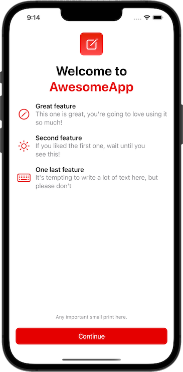

# Welcome Screen

Based on Paul Hudson [HWS+](https://www.hackingwithswift.com/plus/) "Remaking apps" article series, we are building the welcome screen as it can be found in Apple's own apps like Notes, Reminders, ...

- Welcoming headline
- two to four "featured highlights"
- each consisting of a title, short description and an accompanying image
- small print for some additional information (e.g. privacy information)
- continue button

## Screenshot

